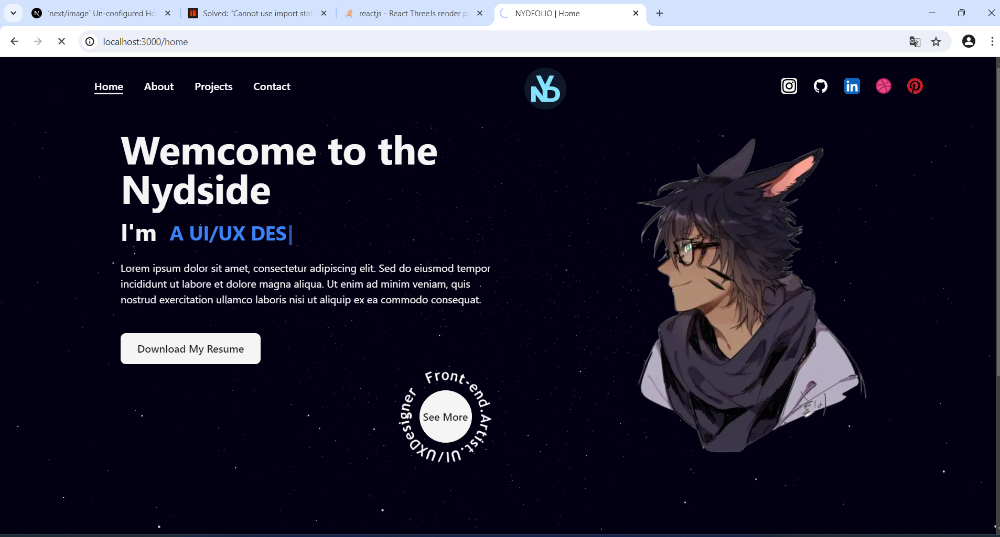

# Le_Portfolio

# 🐼 Nydfolio


Nydfolio est mon portfolio personnel réalisé avec Next.js, intégrant des animations, des expériences 3D avec Three.js, et présentant mes projets dans les domaines du web, du design, et de l'art (dessin). 

- [Voir le site](https://nydfolios.vercel.app/)

## Aperçu



## Table des matières

- [Installation](#installation)
- [Technologies utilisées](#technologies-utilisées)
- [Structure du projet](#structure-du-projet)
- [Fonctionnalités](#fonctionnalités)
- [Animations](#animations)
- [Expériences 3D](#expériences-3d)
- [Contribuer](#contribuer)
- [Contact](#contact)

## Installation

Assurez-vous d'avoir Node.js installé avant de démarrer.

1. Clonez le repository:

```bash
git clone https://github.com/DarylNyd/Le_Portfolio.git
```

2. Accédez au répertoire du projet:

```bash
cd nydfolios
```

3. Installez les dépendances:

```bash
npm install
```

4. Démarrez l'application en mode développement:

```bash
npm run dev
```

5. Ouvrez votre navigateur et accédez à http://localhost:3000.

## Technologies utilisées

- Next.js
- Tailwind CSS
- SCSS
- Framer Motion
- Three.js

## Structure du projet

- /pages: Contient les pages du site.
- /components: Regroupe les composants réutilisables.
- /styles: Les fichiers de styles, SCSS et Tailwind.
- /public: Ressources statiques telles que les images.

## Fonctionnalités

- Page d'accueil avec informations personnelles, réseaux sociaux, parcours, et expériences.
- Page de projets divisée en sections : web, design, art.
- Page de contact pour me joindre.

## Animations

Les animations sont gérées avec Framer Motion et Tailwind CSS pour créer une expérience utilisateur fluide et agréable.

## Expériences 3D(optionnelle)

Utilisation de Three.js pour intégrer des éléments 3D et ajouter une dimension interactive à certains aspects du site.

## Contact

Pour toute question ou demande de collaboration, n'hésitez pas à me contacter:

Email:
LinkedIn:

## Credits

by **_Yvan Daryl Ndenga Nemeck_**.
